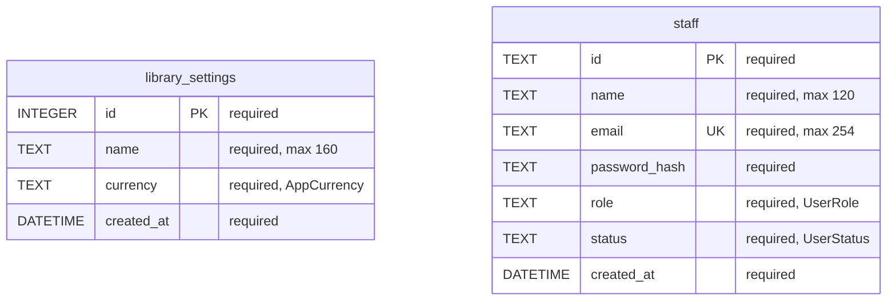

# Database schema

> DO NOT HAND-EDIT. Generated from `drift_schemas/app_database/drift_schema_v2.json` by `tools/db_diagram.dart`. Regenerate with `make db-diagram`.

## ER diagram — schema v2

Renders on GitHub and in VS Code Markdown preview.

## Tables

### `library_settings`

- Source: `lib/features/settings/data/tables/library_settings.dart`
- Enforces `CHECK (id = 1)`.
- No outgoing foreign keys.

### `staff`

- Source: `lib/features/users/data/tables/staff.dart`
- No outgoing foreign keys.

